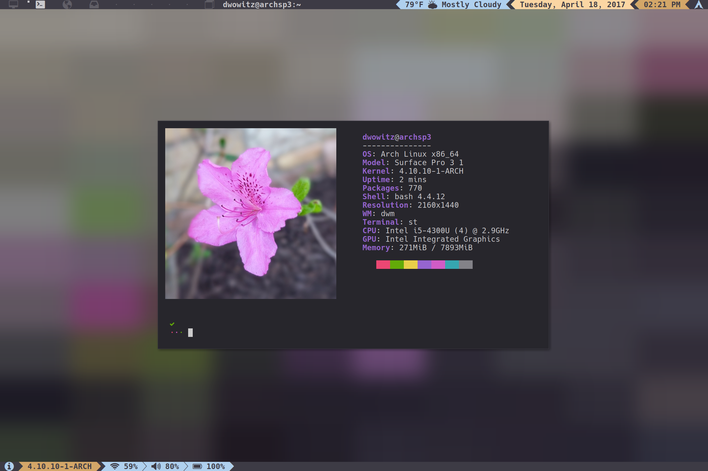

# my_dwm-git
> Forked from https://aur.archlinux.org/dwm-git.git

PKBUILD and Makefile have been modified to append the system users name to the
package name and executable allowing each user to install their own customized package.

This repo also includes my personal dwm configuration and patchset.



---

## Installation

Arch Linux:

```sh
makepkg && sudo pacman -U *.xz
```

---

## Usage example
```sh
startx /usr/bin/dwm_dwowitz
```

---
